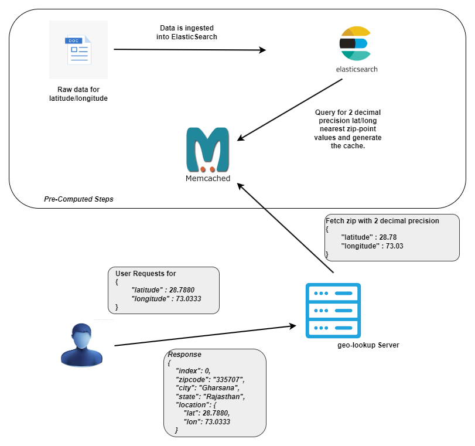

## The go-geo-lookup Server is designed to efficiently fetch the zip code corresponding to a given set of latitude and longitude coordinates in India.

Data  for Latitude and longitude for city and zip is avaliable at [geonames](https://download.geonames.org/export/zip/). this data is available free from government web sites and .org web sites.

### Brief description
---
* The geo-lookup process certainly involves following steps
    1. User request is received with latitude and longitude by the web service or application.
    2. Query the data source and retrieve the nearest zip code calculated using nearest Geo distance algorithm.
* The nearest point calculation involves selecting a set of points (within an approximate radius of x km) from the CityZipLatLong database (Elasticsearch, in our case) around the given latitude and longitude, and determining the point with the minimum distance among the distances from each selected point.
* The geographical distance between two latitude and longitude points is explained here: [Geographical Distance](http://en.wikipedia.org/wiki/Geographical_distance)
Using Elasticsearch for this purpose allows us to leverage its geo-point query feature to fetch the nearest point.

* Given this, we can fetch the nearest zip code for each latitude and longitude in India and insert it into the cache. However, it's important to note that latitude in India ranges from 8 to 37, while longitude ranges from 68 to 97. Since latitude and longitude values have four-digit precision, we will have approximately 85 billion combinations from the 295,999 (latitude values between 8.4000 and 37.9999) multiplied by 289,999 (longitude values between 68.0000 and 96.9999).

* To enable a simple and ultra-fast geo-lookup service, we need to follow an approach that does not use geo-distance calculation services during user requests at runtime, without affecting the accuracy of nearest point calculations. This means we need to create a cache through pre-processing. Additionally, the cache size should be smaller.

**Cache Generation Analysis**

* Latitude in India ranges from 8 to 37, while longitude ranges from 68 to 97. A 0.01 difference in latitude is approximately 1 km, and a 0.01 difference in longitude is around 1.5 km. Given this, the percentage of points among all possible latitude and longitude combinations in India that may spill into an adjacent zip code could be less than 0.5 percent. For most websites and applications, using two decimal precision should be acceptable.
* With two decimal precisions, we can determine the worst-case count of latitude and longitude values for India. This results in around 9 million combinations (3,100 latitude values between 8.40 and 38.00 multiplied by 2,870 longitude values between 68.70 and 97.40). Furthermore, about 50-60% of the area defined by India's latitudinal and longitudinal extremes is land, with the rest being water. Hence, our cache size would be much smaller than the estimated 9 million values.
* With this approach, we can generate the cache (using memcache for this purpose) for the two decimal values.

### Flow


---

### Usage and Setup
---

**Configuring Elastic Search**

* Please refer the docker-compose file available [here](https://github.com/salmangada/go-geo-lookup/blob/main/docker/elastic-search/docker-compose.yml).
 This configuration will create two nodes in the Elasticsearch cluster. You can designate one of the nodes as a replica to improve read efficiency.
* Use the following cURL command to create an index and its mapping:
```bash
curl --location --request PUT 'http://localhost:9200/geo_data' \
--header 'Content-Type: application/json' \
--data '{
    "mappings": {
        "properties": {
            "index": {
                "type": "integer"
            },
            "zipcode": {
                "type": "text" 
            },
            "city": {
                "type": "text"
            },
            "state": {
                "type": "text"
            },
            "location": {
                "type": "geo_point"
            }
        }
    }
}
'
```
* To ingest data into Elasticsearch, download and run the bash file available [here](https://github.com/salmangada/go-geo-lookup/blob/main/ingestor/IN-rows.zip).

**Running Application**

* Set up the Memcached server by running the Docker container:
```bash
docker run -d --name memcache-container -p 11211:11211 memcached:latest
```
* Start the app:
```bash
go run main.go
```
The app will listen on ```localhost:3333```

**APIs**

| API        | Response           | Description  |
| ------------- |:-------------:| :-----|
| /process-cache      |       |   Will Start generating the cache by fetching the nearest points from ES. |
| /fetch-location?latitude=2.0011&longitude=81.4500| | Fetches the Point from cache |

### Note
---

This server is not throughouly tested, And this is reference implementation for learning purpose. 

### Reference 
---
[Paypal Tech Blog](https://medium.com/paypal-tech/implementing-a-fast-and-light-weight-geo-lookup-service-128e595ff0fe)

[Not to forget](https://chatgpt.com/)


